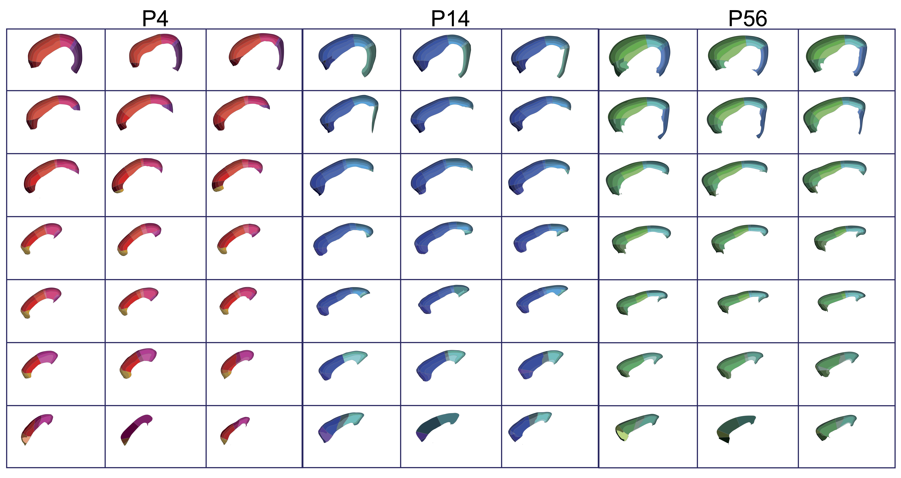
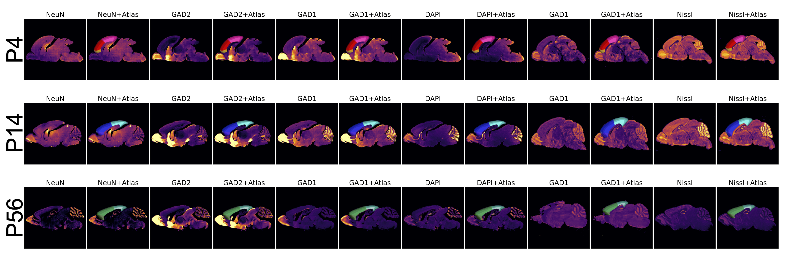

<h2 style="text-align: center;">Introduction</h2>

A mesoscale understanding of human brain development is the key to unlocking several neurodevelopmental disorders. Leveraging AI-based techniques to study the development of the cortex at the granular level involves the analysis of high-resolution, multi-modal brain imaging datasets, captured at various postnatal ages, and annotated for distinct anatomical and functional subregions and layers. We present MortX, a benchmark dataset of the developing mouse cortex, captured at multiple postnatal ages and annotated for anatomically and functionally distinct sub-regions and layers. MortX incorporates high-resolution, multi-modal brain imaging data, including bright-field and fluorescence imaging, and is labeled with prominent neuronal markers. We first construct a standardized cortical atlas validated by genetic markers, and manually register the atlas to each brain section image to generate ground-truth labels. MortX serves as a benchmark for domain generalization in neuroimaging tasks, allowing classical and deep learning models to be trained on source brains and evaluated on unseen target brains. We demonstrate the generalized performance of multiple models, as well as their efficacy of structural invariance across different ages. To foster neuroscience research, we open-source MortX as a community resource for mouse brain segmentation and registration, with a focus on domain adaptation. MortX addresses crucial challenges in mouse brain imaging data and sets the stage for advancing machine learning models that will contribute to unraveling the mysteries of neurodevelopmental disorders.

<h2 style="text-align: center;">Mapping the Developing Cortex</h2>

High-level overview of the developing cortical atlas across salient mouse postnatal ages. The mapping of each atlas section is discovered and represented in the same order as the brain delineates over time.

<h2 style="text-align: center;">Domain Representation</h2>

The structural and domain variability of the dataset is represented using a few sample of mouse brain sections, covering different genetic markers with their overlaying cortical atlas labels.

<h2 style="text-align: center">Domain Generalization tasks</h2>

The possible combinations for training on source (rows) and testing on unseen target (columns) domains are presented with their train/test ratio numbers on top. The dark colors represent tasks with higher-level of complexity, whereas light colors depict the easier tasks with include large training set for domain robustness.

<h2 style="text-align: center">Broader Impact</h2>

The MortX benchmark has profound implications for neuroscience and AI research. In neuroscience, MortX provides a necessary and much sought-after tool for understanding mouse brain development at different postnatal ages. This granular level of detail can offer vital insights into neurodevelopmental disorders, contributing to improved diagnostic and therapeutic strategies. In the domain of AI, MortX is a significant step forward in addressing the challenge of domain generalization. The benchmark can be used to evaluate the robustness of machine learning models against shifts in data distribution, contributing to the development of more reliable and domain-invariant models. By releasing MortX as open-source, we hope to stimulate advancements in both neuroscience and AI, and in the intersection of the two disciplines.

<!--  -->
