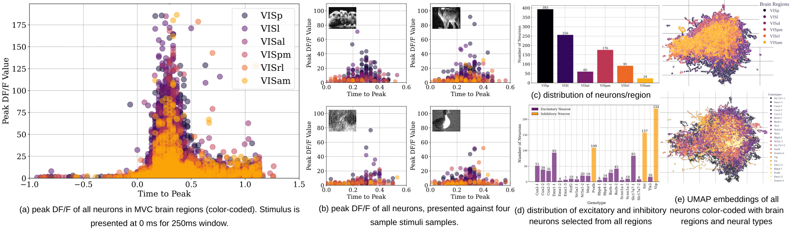
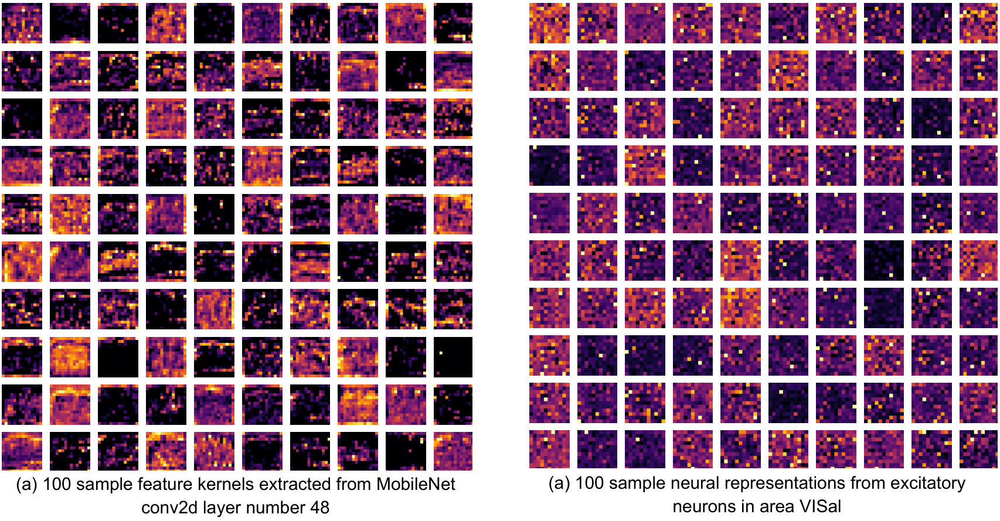
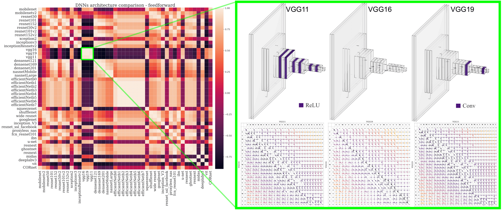
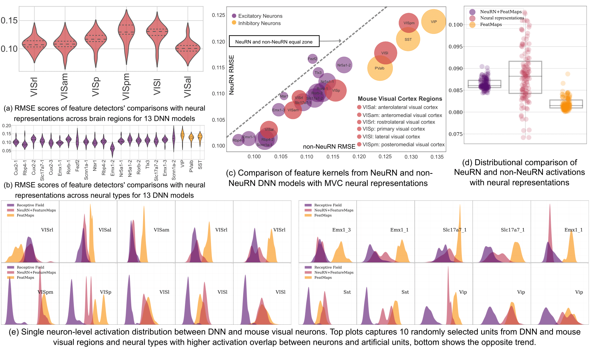

<h2 style="text-align: center;">Introduction</h2>

A mesoscale understanding of human brain development is the key to unlocking several neurodevelopmental disorders. Leveraging AI-based techniques to study the development of the cortex at the granular level involves the analysis of high-resolution, multi-modal brain imaging datasets, captured at various postnatal ages, and annotated for distinct anatomical and functional subregions and layers. We present MortX, a benchmark dataset of the developing mouse cortex, captured at multiple postnatal ages and annotated for anatomically and functionally distinct sub-regions and layers. MortX incorporates high-resolution, multi-modal brain imaging data, including bright-field and fluorescence imaging, and is labeled with prominent neuronal markers. We first construct a standardized cortical atlas validated by genetic markers, and manually register the atlas to each brain section image to generate ground-truth labels. MortX serves as a benchmark for domain generalization in neuroimaging tasks, allowing classical and deep learning models to be trained on source brains and evaluated on unseen target brains. We demonstrate the generalized performance of multiple models, as well as their efficacy of structural invariance across different ages. To foster neuroscience research, we open-source MortX as a community resource for mouse brain segmentation and registration, with a focus on domain adaptation. MortX addresses crucial challenges in mouse brain imaging data and sets the stage for advancing machine learning models that will contribute to unraveling the mysteries of neurodevelopmental disorders.

<h2 style="text-align: center;">Mapping the Developing Cortex</h2>

High-level overview of the developing cortical atlas across salient mouse postnatal ages. The mapping of each atlas section is discovered and represented in the same order as the brain delineates over time.

<h2 style="text-align: center;">Allen Brain Observatory Data</h2>

Mouse Visual Cortex (MVC) data statistics: The peak activation profiles of all neurons are presented as well as their cluster profiling and distribution based on neural genotypes and brain regions.

<h2 style="text-align: center">Feature Represntations</h2>

Representational similartiy between feature detectors in a sample DNN model and MVC neural representations

<h2 style="text-align: center">DNN Architectural Similarity</h2>

DNNs' architectural similarity: The confusion matrix on the left shows the correlation similarity of 44 DNN architectures with purple as the lowest and skin as the highest correlation. The zoom version of three similar architectures (VGG11, VGG16 and VGG19) are displayed with the highlighted layer difference between VGG16 and VGG11 as ReLU and Conv between VGG16 and VGG19. The bottom matrices show the Needleman-Wunsch algorithm applied on these architectures and how the traceback matrix was used to calculate similarity index.

<h2 style="text-align: center">Population & Neuron Level Analysis</h2>

(a) RMSE scores of comparing feature detectors with neural representations across MVC brain regions for all the shortlisted DNN architectures, (b) shows the similar focused across neural sub-types: excitatory and inhibitory neural genotypes. The comparison between NeuRN and non-NeuRN architectures are shown in (c) with diagonal line defining the winning models for their neural compatibility. In (d), comparison of neural representations and DNN activations is mapped for both NeuRN and non-NeuRN DNN architectures, showing the activation curves of randomly sampled units in (e).

<h2 style="text-align: center">Summary</h2>

In this study, we explore the fascinating interplay between artificial and biological neural networks. Our work reveals a striking similarity between these systems, particularly with excitatory genotypes. To further investigate, we developed NeuRN, a neuro-inspired layer for Deep Neural Networks (DNNs), which enhances the resemblance between artificial and biological representations. Our detailed analyses at both population and single neuron levels confirmed the increased similarity and biological plausibility brought about by NeuRN. This novel layer not only boosts the generalizability and robustness of DNNs but also significantly improves performance on domain adaptation tasks, as evidenced by our experiments with Neural Architecture Search and various DNNs. In essence, our findings underscore the potential of biological mechanisms to significantly refine and advance artificial neural networks.

<!--  -->
